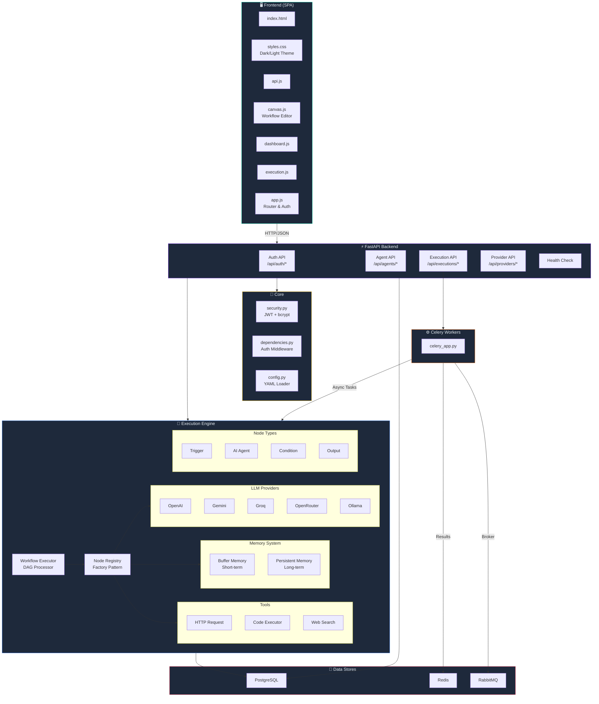
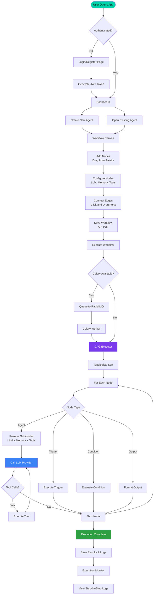
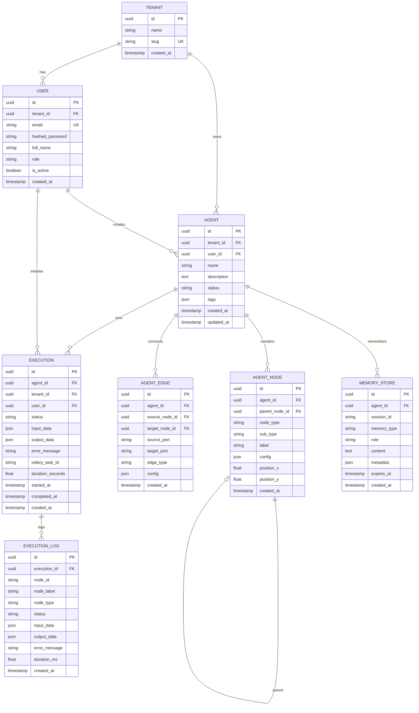
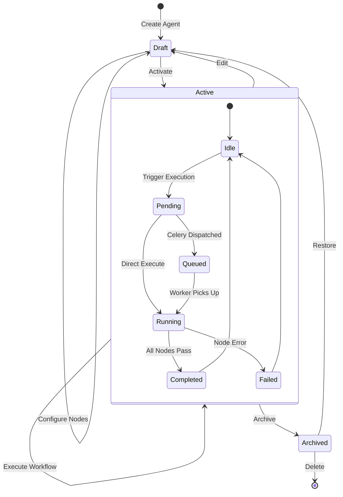
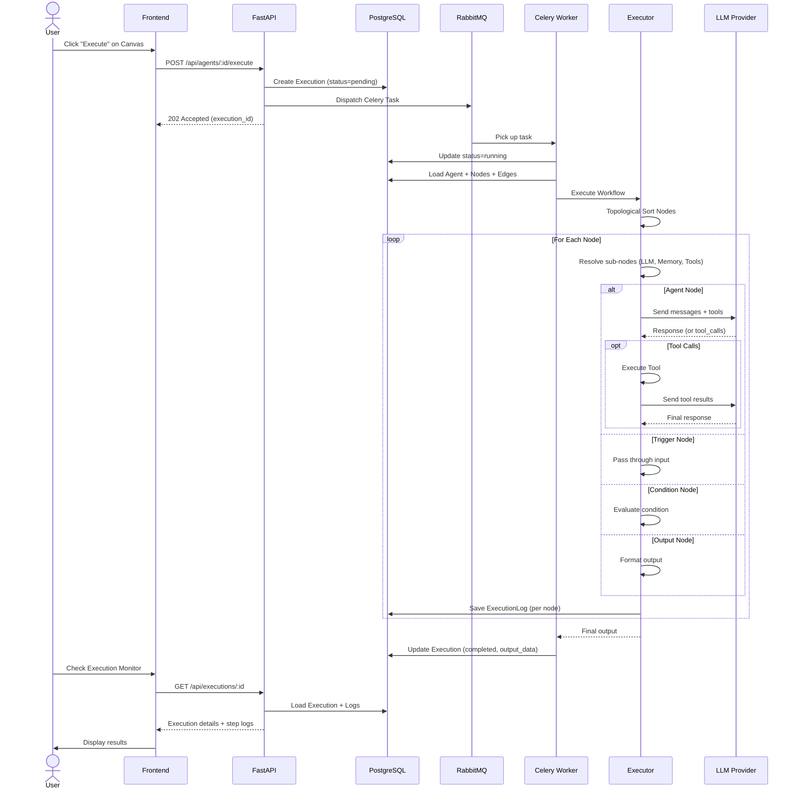
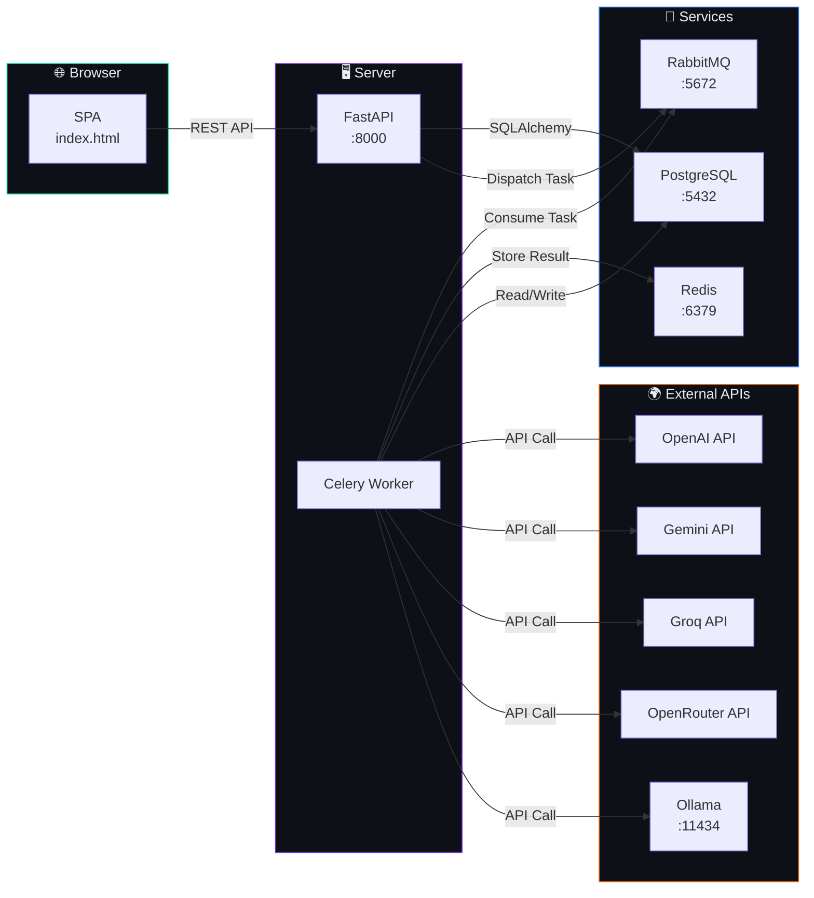

# 🏗️ AgentForge Architecture Documentation

## Project Architecture Diagram

---

## Process Flow Diagram

---

## ER Diagram (Entity Relationship)

---

## State Diagram (Agent Lifecycle)

---

## Sequence Diagram (Agent Execution Flow)

---

## Component Interaction Diagram

